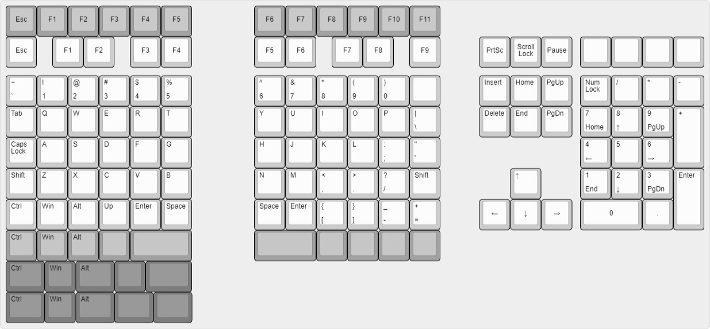

# Layouts

Here are just some of the renders of KLE. Just uploads the json if you want to modify them

## Full

The full design reference

## Prototype

Already split the JSONs to make it easier to use in the prototyping software.

## PCB A

Full layout for design reference

The numpad stayed the same as the prototype

Here is one half of the pcb (left or right)

