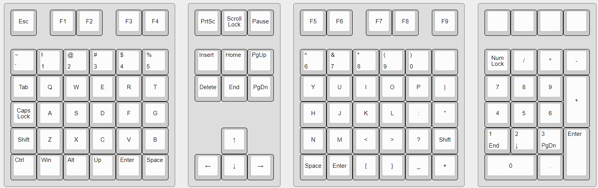

# Tekskey

An ortholinear split keyboard with a modular twist.

> [!CAUTION]
> **Tekskey is still in development.** I advise against trying to build it from the files in this repo. While the prototypes do function, they are complex to assemble, and the design is not yet refined for aesthetic appeal.

## Vision

The vision for our ortholinear split keyboard revolves around a modular design consisting of four key components: the left split, the right split, an arrow keys module, and a numpad module. Those modules can be arranged however you like, I for example like the arrows between the two splits, and the numpad on the right side.

## Process

### V1: Handwired Prototype

- 4 handwired modules using RP2040 in a 3D printed case
- currently only 2 modules are seen as one USB device, the arrows and numpad still act seperately

### V2: PCB Prototype

- the two main modules were replaced with PCBs

### V3: In Progress

- refine the PCB design
- enable the connection of all 4 modules to one USB device
