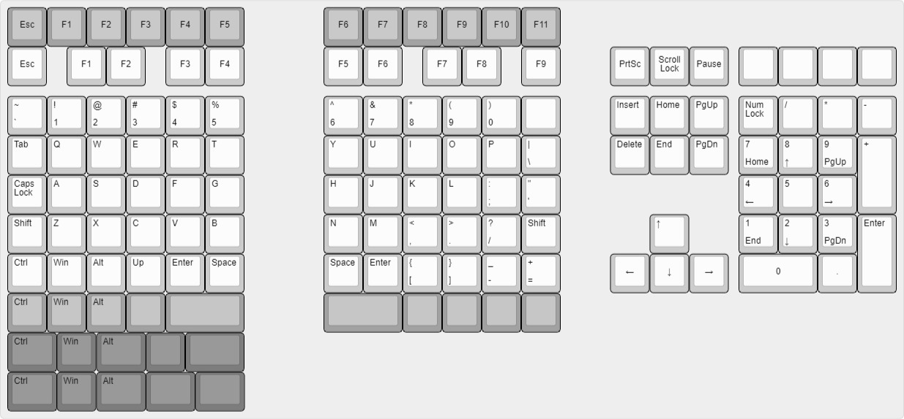

# Tekskey

> WIP This project is still in its prototyping phase

TODO description. Keypoints: modular, hotswap, ARGB, mirage. Usage of git submodules and stow

## Design Process

### Layout Testing with print outs

With [KLE](http://www.keyboard-layout-editor.com/) I came up with a base layout (white):

As I was unsure about the top & bottom design, I included multiple variants. The pcb version should also include support for the light gray variant (PCB A variant), which also allows to use the same pcb for left & right.

More images can be seen in [layouts/](layout/readme.md)

### Handwired 3d printed hotswap prototype

Using the [hotswap PCB generator](https://github.com/50an6xy06r6n/hotswap_pcb_generator) I printed a first prototype which I used and tested for a few weeks. The 3d printed prototype only supports the white layout.

For more renders, source and print files see [prototype](prototype/readme.md)

### QMK firmware (I'm thinking about switching to KMK)

TODO

### PCB Design

TODO
